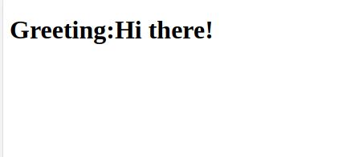

# Hello Rails Front End

A project that is using an Api.

## Screenshot of the page

## Project Decription

This project is rendering a different greeting everytime.

## Build With

- `React`
- `Redux`

## Getting Started

To get a local copy up and running follow these simple example steps.

## Instructions

$ cd <folder>

$ git clone git@github.com:PolinaStamenova/hello-rails-front-end.git

### Install

- Set up liveserver as an extension in your VS Code.
- If you dont have the live server extension, or are using another software just view directly in your browser.

- `npm install`

### Usage

- `npm start `

## Authors

👤 **Polina Stamenova**

- GitHub: [@githubhandle](https://github.com/PolinaStamenova)
- LinkedIn: [LinkedIn](https://www.linkedin.com/in/polina-stamenova-a60766112/)

## 🤝 Contributing

Contributions, issues, and feature requests are welcome!

Feel free to check the [issues page](https://github.com/PolinaStamenova/hello-rails-front-end/issues).

## Show your support

Give a `⭐️` if you like this project!

## Acknowledgments

- Microverse
